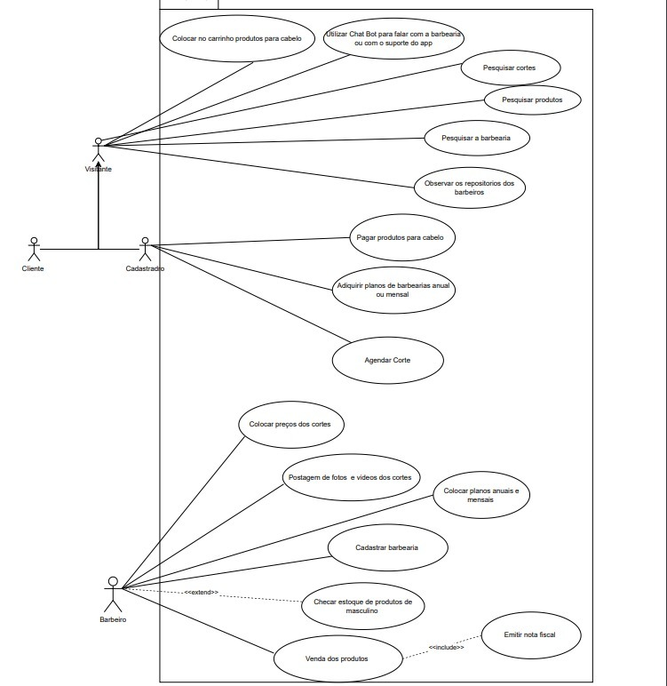

# Documentação do Projeto 

# Navalha App

# Introdução 
O projeto *Navlha App* é um aplicativo inovador desenvolvido para transformar a experiência de gestão e atendimento em barbearias. Criado com o framework Flutter e utilizando a linguagem Dart, o aplicativo oferece uma interface moderna e intuitiva, pensada para facilitar tanto o dia a dia dos barbeiros quanto o agendamento de serviços pelos clientes.

## Arquitetura

Para a criação do *Navalha App*, foi utilizada a arquitetura **MVC** (Model-View-Controller), uma das abordagens mais eficazes para desenvolvimento de aplicativos robustos e bem estruturados. Esta arquitetura promove a separação de responsabilidades em três componentes principais, facilitando a manutenção, a escalabilidade e a organização do código:

1. **Model (Modelo)**: No *Navalha App*, o componente Model é responsável por representar a lógica de negócios e os dados da aplicação. Ele gerencia as informações relacionadas aos usuários, barbearias, serviços, agendamentos e vendas, bem como a interação com o banco de dados SQLite. O Model inclui classes como `Usuario`, que encapsulam os dados e métodos necessários para a manipulação dessas informações, além de garantir a integridade e consistência dos dados.

2. **View (Visão)**: O componente View é responsável pela interface com o usuário (UI) do *Navalha App*. As Views são implementadas como telas em Flutter, onde cada tela é construída como um `StatefulWidget` separado. Estas telas exibem os dados fornecidos pelo Model e permitem que o usuário interaja com a aplicação de forma intuitiva e visualmente atraente, seguindo a paleta de cores estabelecida para o aplicativo.

3. **Controller (Controlador)**: O Controller atua como um intermediário entre o Model e a View. Ele processa as entradas do usuário, interage com o Model para obter ou atualizar dados, e instrui a View sobre como apresentar essas informações. No *Navalha App*, o Controller garante que a lógica de negócios seja aplicada corretamente e que as mudanças no estado do aplicativo sejam refletidas na interface do usuário de maneira eficiente.

# Funcionalidades 

O *Navalha App* foi desenvolvido para atender às principais necessidades de gestão e operação de uma barbearia moderna. As funcionalidades básicas do aplicativo incluem:

